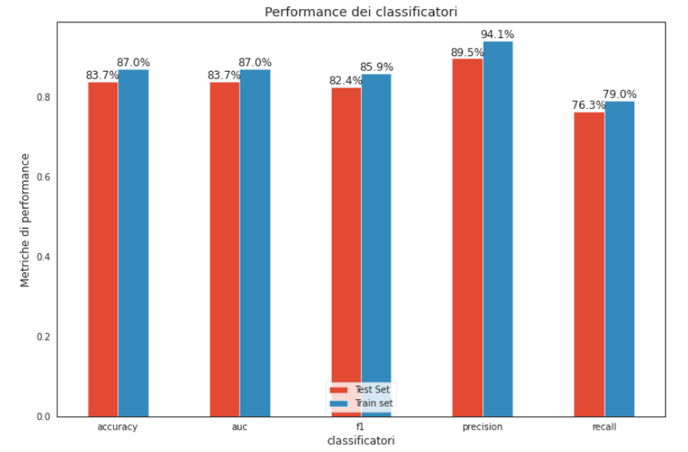

# Road Accident Severity Prediction 💥🚗


## 🚀 Overview

<p align="center">
    
</p>

This repository contains the project for the **Data Mining** exam of the Master's degree in Computer Engineering at the **University of Calabria**, completed in **June 2022**. 
For a detailed explanation of the project, refer to the **project report** and **presentation** in the `docs/` folder.

---

## 🎯 Project Objective

The goal of this project is to develop a **binary classifier** to predict the severity of road accidents as either:
- **🟢 Minor**: Slight severity, manageable accidents.
- **🔴 Serious**: High severity, serious or fatal accidents.


Using the **UK Department for Transport Open Data** from 2004 to 2017, the project applies advanced data mining techniques, including:
- Data cleaning and preprocessing.
- Feature engineering and selection.
- Balancing the dataset through under-sampling.
- Training and evaluating various machine learning models to determine the best-performing classifier.

The final model aims to assist in understanding road accident trends and improving road safety measures. 🚦

---

## 🗂️ Repository Structure

- **`docs/`**: Contains the project report and presentation.
- **`img/`**: Stores images used in the notebook for visualization purposes.
- **`input/`**: Contains the original datasets (`vehicle information` and `accident information`) in CSV format.  
  > **Note**: These files are not included in the repository due to their size. You can download them from [Kaggle](https://www.kaggle.com/datasets/tsiaras/uk-road-safety-accidents-and-vehicles).
- **`models/`**: Contains models trained using the Random Under Sampling technique before post-processing.  
  > **Missing Files**: `KNN_cv.sav` and `rnd_clf_feature_importance_2.sav` are excluded due to size constraints. Contact me if needed.
- **`models_post_processing/`**: Contains models trained after post-processing using the Near Miss 1 technique for undersampling.  
  > **Missing File**: `KNN_cv.sav` is excluded due to size constraints. Contact me if needed.
- **`score/`**: Includes CSV files where the evaluation scores of all trained models are saved.
- **`set/`**: Contains preprocessed datasets for training and testing with labels.  
  > **Missing File**: The training dataset (`X_train_post_processing.sav`) is excluded due to size constraints. Contact me if needed.
- **`accident-severity-prediction.ipynb`**: The complete notebook of the project, documenting all steps from data analysis to model selection. It is well-commented and serves as a comprehensive guide to the project workflow.
- **`requirements.txt`**: Lists the Python dependencies required to run the project.

---

## 🛠️ Installation

1. Clone the repository:  
   ```bash
   git clone https://github.com/fulvio9999/accident-severity-classifier.git
   cd accident-severity-classifier
   ```
2. Create the virtual environment via conda
    ```bash
    conda create -n accident_classifier python=3.7
    ```
3. Activate the virtual environment
    ```bash
    conda activate accident_classifier
    ```
3. Install the dependencies
   ```bash
   pip install --user --requirement requirements.txt
   ```

---

## 📊 Dataset Overview

The dataset is available on [Kaggle](https://www.kaggle.com/datasets/tsiaras/uk-road-safety-accidents-and-vehicles?select=Vehicle_Information.csv) and it is sourced from the **UK Department for Transport Open Data**. It contains information on road traffic accidents recorded between 2004 and 2017 and includes detailed information on accident circumstances and the vehicles involved.

### Key Details:
- **Total Records**: 2,047,256 across 34 features for *Accident_Information* dataset and 2,177,205 across 24 features for *Veichle_Information* dataset.
- **Training Set**: 2,037,823 samples (after joining).
- **Test Set**: 20,585 samples (after joining).

### Features:
The dataset consists of:
- **Accident Information**: Includes time, location, and environmental conditions (e.g., weather, road type).
- **Vehicle Information**: Characteristics of the vehicles involved.

The class label is the feature **Severity**, classified as:
  - **🟢 Slight**: Slight severity accidents (80.4% of records).
  - **🟠 Serious**: Serious accidents (17.7% of records).
  - **🔴 Fatal**: Fatal accidents (1.9% of records).

### Challenges:
- High dimensionality with 56 features.
- Severe class imbalance requiring resampling techniques to ensure balanced training.

---

## 🛠️ Pipeline Steps

### ⚙️ Data Preparation
- Import relevant libraries and the dataset from a `.csv` file into a format suitable for further analysis.
- Split the dataset into a **training set** and a **testing set**, isolating the test set for final model evaluation.

### 🔍 Exploratory Data Analysis (EDA)
- Perform exploratory data analysis on the original dataset to uncover insights about road accidents in the UK.
- Analyze trends, relationships, and distributions within the dataset.

### 🛠️ Preprocessing
- **Data Cleaning**: 
  - Handle missing values and remove outliers.
  - Balance the dataset to address class imbalance using techniques like undersampling.
- **Feature Selection**:
  - Select a subset of features using supervised techniques or importance scores provided by classifiers such as Random Forest.
- **Data Transformation**:
  - Convert categorical features into numerical ones using encoding techniques.
  - Normalize numerical values to handle scaling issues.
- All preprocessing steps are encapsulated into a **pipeline**, ensuring an automated workflow from raw data to processed output.

### 🤖 Model Selection
- Train multiple machine learning models using **K-fold cross-validation** to compare their performance on a validation set.
- Select the best-performing model based on its cross-validation score.

### 🔄 Post Processing
- Refine the undersampling technique and retrain the models.
- Reevaluate the classifiers to identify further improvements in model performance.

### 📏 Performance Evaluation
- Evaluate the performance of the best model on the **test set**, providing metrics such as accuracy, precision, recall, and F1 score.

### 📜 Conclusion
- Summarize the steps performed in the project.
- Present the final **pipeline** for predicting road accident severity as a standalone solution.

---

## 🖼️ Screenshots and Results

Here are a few selected screenshots showcasing minimal data analysis and key results from the project, as the full set of visuals is included in the project report:

### 🔍 Exploratory Data Analysis (EDA):
<p align="center">
    
    
    
    
</p>

### 📏 Models Performances
Here are shown results on validation set for different selected models:

<p align="center">
    
</p>

### 🏆 Results:
The project evaluated various models, and the final pipeline was built using **Random Forest** as the classifier due to its performance (based on accuracy score):
- **Accuracy**:
  - **Training Set**: 87.0%.
  - **Test Set**: 83.7% 🎯.
- **Recall**: 76.3%.
- **Precision**: 89.5%.

<p align="center">
    
</p>

---

## 🔗 References

[1] **UK Department for Transport Open Data**: Road Accidents and Safety Data.  
  [https://www.data.gov.uk/dataset/cb7ae6f0-4be6-4935-9277-47e5ce24a11f/road-accidents-safety-data](https://www.data.gov.uk/dataset/cb7ae6f0-4be6-4935-9277-47e5ce24a11f/road-accidents-safety-data)

<p align="center">
    
</p>
